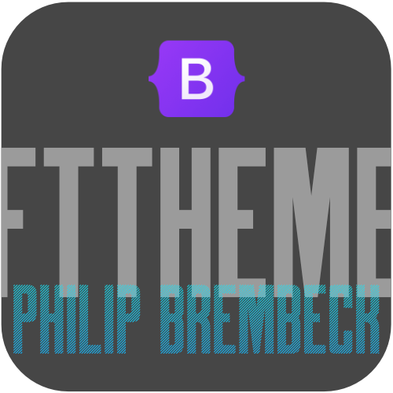
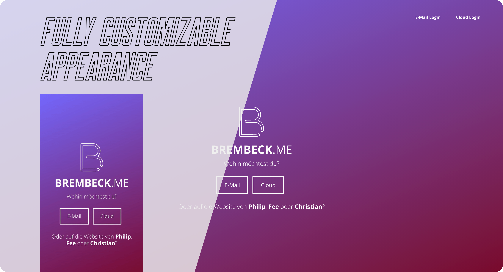

<div align="center">



# ft theme for bootstrap


A simple Bootstrap theme for one-page/hero sites, which looks and feels great on mobile and on desktop, built with mobile-first in mind.

<br/>



FT Bootstrap Theme was created for [Bootstrap](https://getbootstrap.com) (**v5.0.2**+, but it's downwards compatible until **v3.3.4**) and while it is recommended, you don't even have to include Bootstrap to use this theme (It works stand-alone).

</div>

## 💻 Installation 
Basically, you can just start right away by downloading the code or cloning this git repository, as all used tools are included. 

Clone this repository with:

    gh repo clone jokenetwork/FT-Bootstrap-Theme

or via HTTPS:

    https://github.com/jokenetwork/FT-Bootstrap-Theme.git

## 👉 Usage 
I'd recommend to use [Sublime Text](https://www.sublimetext.com) for editing files directly within this project and [PrePros](https://prepros.io) to compile the scss-files (if you want to change them).

The main-stylesheet is located at `/assets/css/main.css`, while its base is located at `/assets/css/_partials/_base.scss` (animate.css & bootstrap.css includes are inside here too!). 
The main.scss-file to compile can be found in `/assets/css/main.scss`.

<details>
  <summary>**See here for the Stand-Alone Version**</summary>
  
  ```scss
    ~~@import url(bootstrap.min.css);~~
    @import url(animate.min.css);
  ```
</details>

## 👉 Demo
You can see the theme in action (with additional changes) [here](https://brembeck.me) or view the uncostumized project [here](https://home-5003623867.app-ionos.space/example.html).

## 👉 What's included
    assets/
    ├── css/
    │   ├── _globals/
    │   │   ├── _mixins.scss
    │   │   └── _normalize.scss
    │   ├── _partials/
    │   │   └── _base.scss
    │   ├── animate.min.css
    │   ├── bootstrap.min.css
    │   ├── main.css
    │   ├── main.css.map
    │   ├── main.scss
    │   └── fonts/
    │       └── diverse font files
    └── img/
        └── favicon.ico
    example.html
 
## 👩‍⚖️ License
FT Bootstrap Theme is licensed under the MIT License, © 2021 Philip Brembeck.

The copy of the license, found under "LICENSE" in the main directory of this project, shall not be deleted nor edited, but iuncluded in every copy. 

## 🤝 Credits

This Theme uses:

 - [Bootstrap v5.0.2](https://getbootstrap.com)
 - [Normalize.css](https://necolas.github.io/normalize.css/) by Nicolas Gallagher and Jonathan Neal
 -  [animate.css](http://animate.style) by [Dan Eden](https://daneden.me)
 - Google Fonts [Open Sans](https://fonts.google.com/specimen/Open+Sans) by [Steve Matteson](https://fonts.google.com/specimen/Open+Sans?query=Steve%20Matteson)
